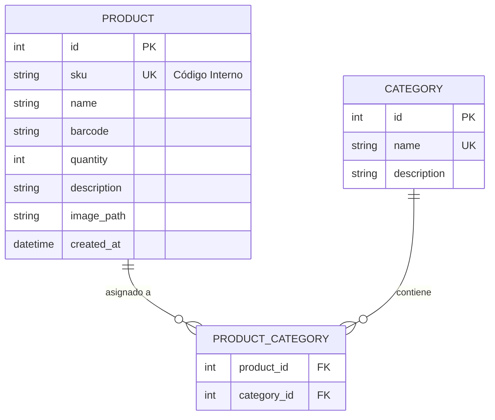
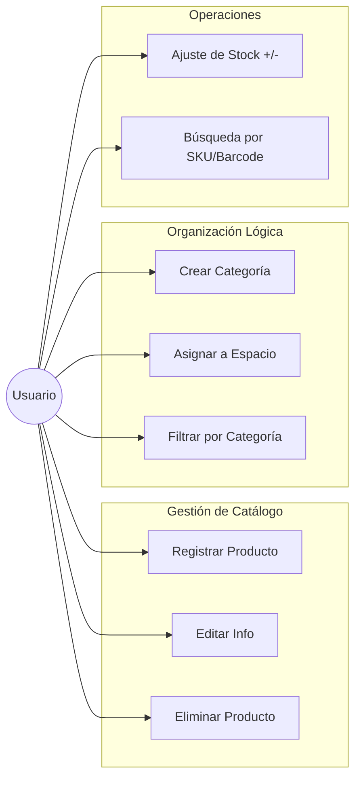
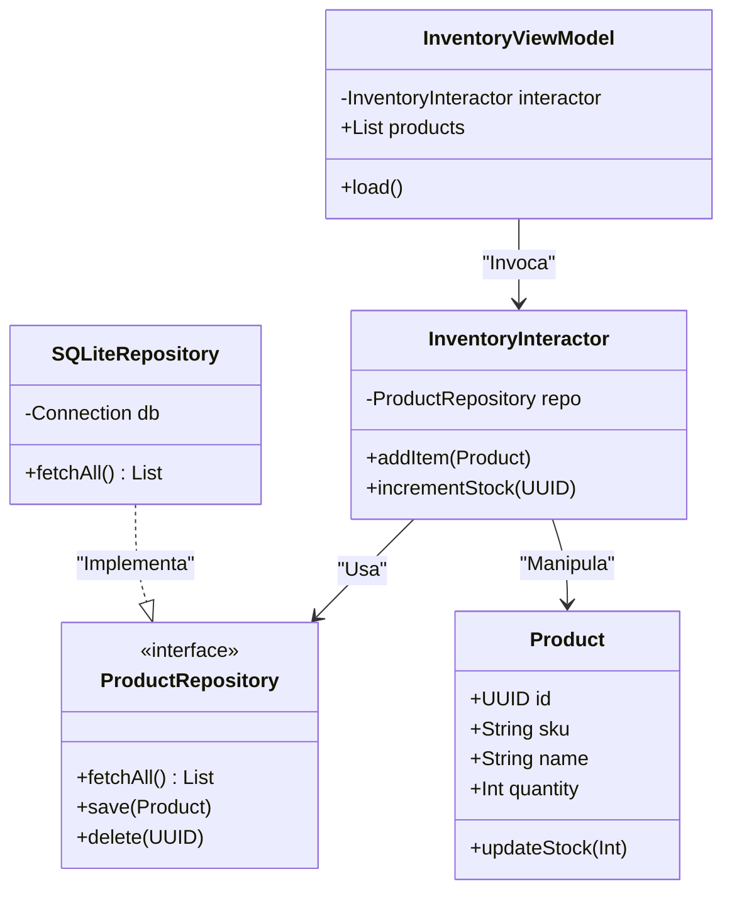

Inventory Master - macOS Edition 📦
Una solución profesional de gestión de inventarios construida bajo los principios de Clean Architecture y POO. Diseñada específicamente para macOS, con capacidad de escalabilidad multiplataforma y sincronización en la nube en futuras fases.

🚀 Propuesta de Valor
A diferencia de los inventarios tradicionales, esta aplicación permite una separación lógica total mediante una base de datos única, permitiendo asignar productos a múltiples "Espacios" (Hogar, Oficina, Jardín) sin duplicar datos.

🛠 Tech Stack
Lenguaje: Swift 6.0 (macOS SDK)

Interfaz: SwiftUI

Persistencia: SQLite (vía Repository Pattern)

Arquitectura: Clean Architecture + MVVM

📊 Diseño de Arquitectura
1. Modelo Entidad-Relación (Base de Datos)
Este diagrama muestra cómo gestionamos la relación muchos-a-muchos entre productos y categorías para lograr la separación lógica.

2. Casos de Uso (Alcance MVP)
El MVP se centra en el ciclo de vida del producto y su organización básica en un periodo de 2 a 4 semanas.

3. Diagrama de Clases (Clean Architecture)
Implementación del Patrón Repositorio para desacoplar la lógica de negocio de la implementación física de la base de datos.

📂 Estructura del Proyecto
/Domain: Entidades puras y protocolos de repositorio.

/Application: Casos de uso (Interactors).

/Infrastructure: Implementación de SQLite y servicios de sistema.

/Presentation: Vistas SwiftUI y ViewModels.
