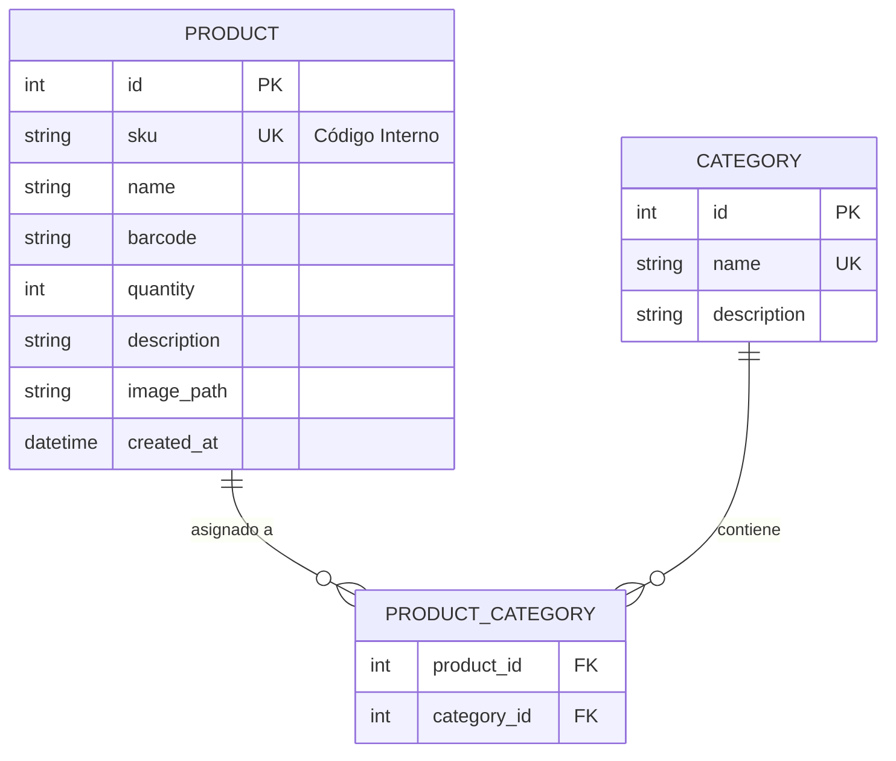
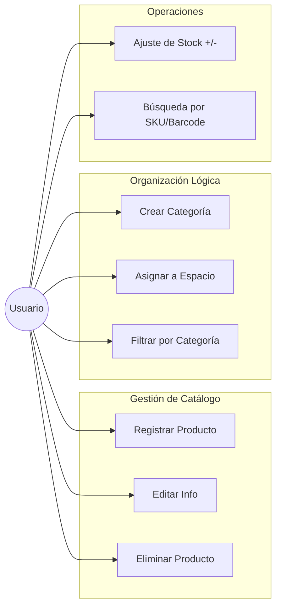
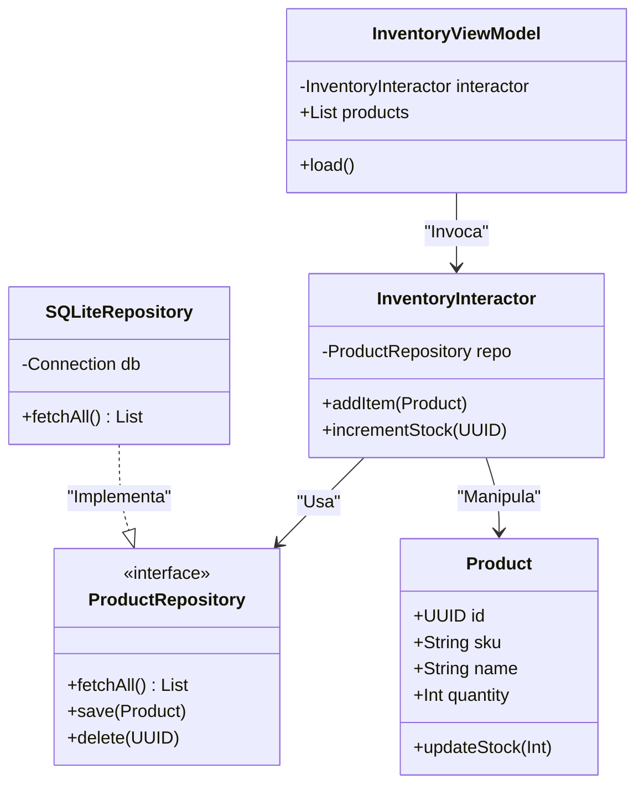

# inventory_app

A new Flutter project.

## Getting Started

This project is a starting point for a Flutter application.

A few resources to get you started if this is your first Flutter project:

- [Lab: Write your first Flutter app](https://docs.flutter.dev/get-started/codelab)
- [Cookbook: Useful Flutter samples](https://docs.flutter.dev/cookbook)

For help getting started with Flutter development, view the
[online documentation](https://docs.flutter.dev/), which offers tutorials,
samples, guidance on mobile development, and a full API reference.

# Inventory Master - macOS Edition 📦

Una solución profesional de gestión de inventarios construida bajo los principios de Clean Architecture y POO. Diseñada específicamente para macOS, con capacidad de escalabilidad multiplataforma y sincronización en la nube en futuras fases.

🚀 Propuesta de Valor
A diferencia de los inventarios tradicionales, esta aplicación permite una separación lógica total mediante una base de datos única, permitiendo asignar productos a múltiples "Espacios" (Hogar, Oficina, Jardín) sin duplicar datos.

🛠 Tech Stack
Lenguaje: Dart + Flutter 

Interfaz: 

Persistencia: Se utiliza estrictamente sqflite_common_ffi para garantizar compatibilidad con macOS Desktop y evitar el error de MissingPlugin.

Arquitectura: Clean Architecture + MVVM

📊 Diseño de Arquitectura
1. Modelo Entidad-Relación (Base de Datos)
Este diagrama muestra cómo gestionamos la relación muchos-a-muchos entre productos y categorías para lograr la separación lógica.

2. Casos de Uso (Alcance MVP)
El MVP se centra en el ciclo de vida del producto y su organización básica en un periodo de 2 a 4 semanas.

3. Diagrama de Clases (Clean Architecture)
Implementación del Patrón Repositorio para desacoplar la lógica de negocio de la implementación física de la base de datos.

# Especificación de Proyecto: Inventory Master (v1.0)

## 1. Visión General
* **Objetivo:** Aplicación profesional de gestión de inventario para macOS con base de datos única y separación lógica por categorías.
* **Plataforma:** macOS Desktop (optimizada para Intel Mac 2019).
* **Metodología:** Scrumban (Sprints semanales + Kanban).
* **Estado Actual:** Versión 1.0 alcanzada.

## 2. Stack Tecnológico
* **Framework:** Flutter (Desktop macOS).
* **Lenguaje:** Dart 3.x.
* **Arquitectura:** Clean Architecture (Domain, Application, Infrastructure, Presentation).
* **Persistencia:** SQLite (`sqflite_common_ffi`).
* **Gestión de Estado:** Provider (con ViewModels).
* **Control de Versiones:** Git + GitHub.
* **Servicios:** `file_selector` (imágenes nativas), `window_manager`.

## 3. Arquitectura de Datos (Backend Local)
**Esquema Relacional:**
* **Products:** `id` (PK), `sku` (UK), `name`, `barcode`, `quantity`, `description`, `image_path`, `created_at`.
* **Categories:** `id` (PK), `name` (UK), `description`, `product_count` (calculado).
* **Product_Categories:** Tabla pivote (Many-to-Many).
* **Stock_History:** Auditoría de movimientos (`change_amount`, `reason`, `date`, `user`).

## 4. Funcionalidades Implementadas (v1.0)

### A. Infraestructura y Lógica
* **Base de Datos:** Implementación SRP con clases `TableSchema` individuales.
* **Repositorios:** Manejo de excepciones con `AppException` y `try-catch` robusto.
* **ViewModels:**
    * `ProductViewModel`: Gestión reactiva de selección, filtrado, búsqueda y ordenamiento.
    * `CategoryViewModel`: CRUD completo de categorías.

### B. Interfaz de Usuario (Layout de 3 Columnas)
1.  **Sidebar (Navegación):**
    * Lista de categorías con contadores (badges).
    * Acceso a "Gestionar Categorías".
    * Diseño responsivo (truncado de texto, ancho dinámico 250px-320px).
2.  **Dashboard (Grid):**
    * Buscador Global (SearchBar) por nombre/SKU.
    * Ordenamiento (A-Z, Stock, Fecha).
    * Grid de tarjetas adaptativas.
3.  **Inspector (Detalle):**
    * Arquitectura modular: `ProductHeader`, `StockControl`, `CategoryEditor`, `MovementHistoryList`.
    * Edición de imagen, nombre y categorías.
    * Historial de movimientos auto-refrescable.

## 5. Refactoring y Calidad 
* **Componentes Reutilizables:** `CustomTextField`, `EditNameDialog`, `StockStepper`, `AppLayout`.
* **Centralización:**
    * **Textos:** `AppStrings.dart` (eliminación de hardcoded strings).
    * **Estilos:** `AppTheme` y `AppThemeExtension` (colores semánticos para stock).
    * **DB:** `SchemaConstants` para evitar "magic strings" en SQL.
* **Testing:** 16 tests automatizados (Unitarios y de Integración) con 100% de éxito. Cubren selección múltiple y repositorios.
* **Estabilidad:** Control de redimensionado mínimo (1000x700px) para evitar colapsos de UI.

## 6. Pendientes / Roadmap Futuro
* In Progress...
